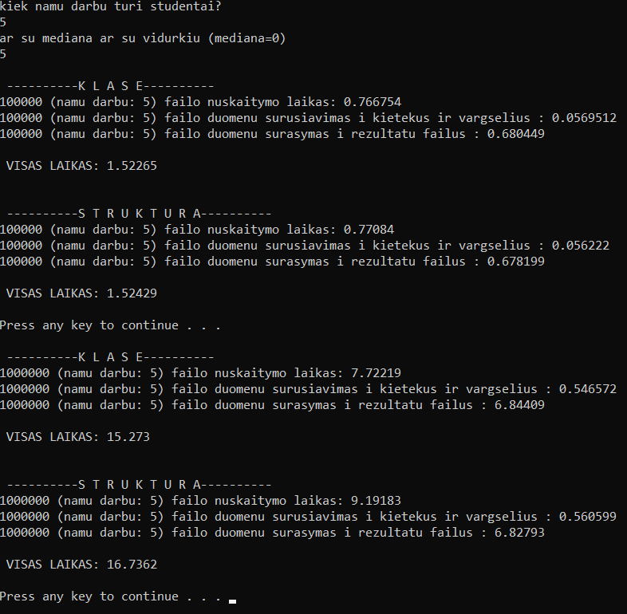
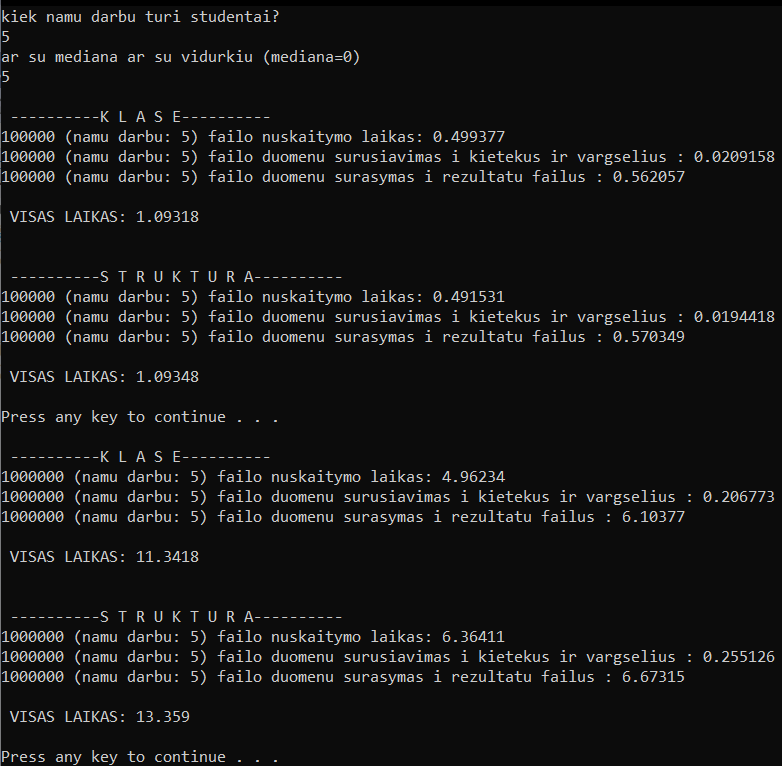
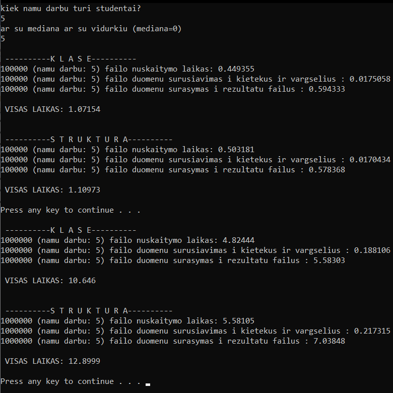
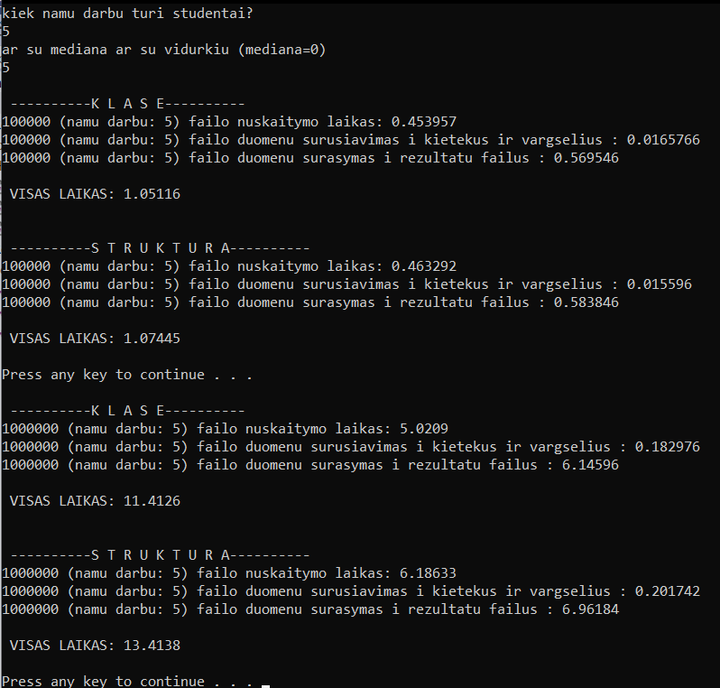

# V1.1
[atgal į master](https://github.com/auteea/2-uzduotis)
## Realizuota užduotis naudojant klasę
Programa atlieka tą pačią užduotį dviem skirtingais būdais ir atlieka spartos analizę (skaičiuoja tam tikrų programos vietų atlikimo greitį).
## rezultatai
realizacija su optimizacija od (disabled)

realizacija su optimizacija o1 (maximum favor size)

realizacija su optimizacija o2 (maximum favor speed)

realizacija su optimizacija ox (optimization speed)

